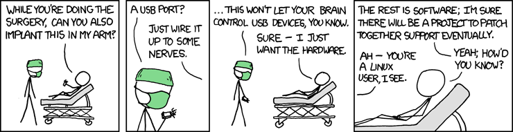

# Intermediate Linux - Taming the Penguin
## Understanding the Technology and Philosophy of Unix/Linux Part II
#### (version 0.0.1)

### LPIC-2 based plus the deltas to the revised material

## Table of Contents

0. Introduction and Notes
 * Objectives of this book/project
 * Who should read it?
 * Who are we?
 * How this book/project works 
 * Acknowledgements
 * Linux/Unix History and Philosophy (pulled from other book)
 * Environment setup
 * Resources for you beyond this book
    -  Blogs and Podcasts
 
1.	Capacity Planning
  * Tools of Troubleshooting
    -  Measure CPU usage
    -  Measure memory usage
    -  Measure disk I/O
    -  Measure network I/O
    -  Measure firewalling and routing throughput
    -  Map client bandwidth usage
    -  Match / correlate system symptoms with likely problems
    -  Estimate throughput and identify bottlenecks in a system including networking
  * Predict Future Resource Needs
    -  Use collectd to monitor IT infrastructure usage
    -  Predict capacity break point of a configuration
    -  Observe growth rate of capacity usage
    -  Graph the trend of capacity usage
    -  Awareness of monitoring solutions such as Nagios, MRTG and Cacti
    -  Monitoring tools such as Ganglia and Vector

2.	The Linux Kernel
  *  Kernel 2.6.x documentation
  *  Kernel 3.x documentation
      -  Compiling a kernel
      -  /usr/src/linux/
      -  Kernel Makefiles
      -  Kernel 2.6.x/3.x make targets
      -  Customize the current kernel configuration.
      -  Build a new kernel and appropriate kernel modules.
      -  Install a new kernel and any modules.
      -  Ensure that the boot manager can locate the new kernel and associated files.
      -  Module configuration files
      -  Awareness of Dracut
  *	 Kernel runtime management and troubleshooting	
    -  Use command-line utilities to get information about the currently running kernel and kernel modules
    -  Manually load and unload kernel modules
    -  Determine when modules can be unloaded
    -  Determine what parameters a module accepts
    -  Configure the system to load modules by names other than their file name.
    -  /proc filesystem
    - Content of /, /boot/ , and /lib/modules/
    -  Tools and utilities to analyze information about the available hardware
         *	udev rules

3.  System Start Up and Recovery	
  * SysVInit 
    -  Customizing SysV-init system startup
    -  Linux Standard Base Specification (LSB)
  * Introduction to Systemd start up  
    - Details about systemd
  * System Recovery
    -  GRUB version 2 and Legacy
    -  Grub shell
    -  Boot loader start and hand off to kernel
    -  Kernel loading
    -  Hardware initialization and setup
    -  Daemon/service initialization and setup
    -  Know the different boot loader install locations on a hard disk or removable device  *  
    -  Overwriting standard boot loader options and using boot loader shells
    -  Awareness of UEFI
  * Alternate bootloaders
    -  PXE
    -  Grub and Grub2

4.	Filesystem and Devices
  * History of Linux filesystems
    -  The concept of the fstab configuration
    -  Tools and utilities for handling SWAP partitions and files
    -  Use of UUIDs
  *	Maintaining a Linux filesystem
    -  Tools and utilities to manipulate and ext2, ext3 and ext4
    -  Tools and utilities to manipulate xfs
    -  Awareness of Btrfs and ZFS and FUSE

5.	Advanced Storage Device Administration
   *  Software raid configuration files and utilities
    - mdadm.conf
    -  mdadm
    -  /proc/mdstat
 * Adjusting Storage Device Access
    -  Tools and utilities to configure DMA for IDE devices including ATAPI and SATA
    -  Tools and utilities to manipulate or analyze system resources (e.g. interrupts)
    -  Awareness of sdparm command and its uses
    -  Tools and utilities for iSCSI
 * Logical Volume Manager
    -  LVM suite
    -  Resizing, renaming, creating, and removing logical drives
    -  Snapshots
    -  Active volume groups

6. Network Configuration
  *  Configure and manipulate Ethernet settings
  *  Configure wireless access via iw
  *  Manipulate route tables
  *  Monitor traffic
  *  Troubleshooting network issues

7. System Maintenance and Tools
  *  tar
  *  make
  *  uname
  *  compression
    - bzip
    - gzip
    - xz
  *  configure
  *  install

8. Web Services 
  *  APACHE
    -  Apache mods
    -  Reverse proxy
    -  SSL configuration
   * NGINX
      - As a reverse proxy
      
9. Domain Name Server
   * BIND
   * DNSMASQ

10.	File Sharing
  * NFS
  * SAMBA
  * Object Storage (Perhaps just an overview of how it works in comparison?)

11.	Network Client Management
  *  DHCP server setup
  *  PAM
  *  OpenLDAP

12.	E-Mail Services

13.	System Security
* Configuring a router 
* Managing FTP servers 
* Secure shell (SSH) 
* Security tasks 
* OpenVPN 

14. Operations Deployment at Scale
  * Packer.io
  * Vagrant 
  * AWS/AZURE commandline 

15. The Future

Appendix A: Glossary

Appendix B: Notes

- - -
## Chapter 00 - Introduction

> Astute quote goes here

### 0.1 - Objectives of this book/project

#### Course Objectives:
  * Administer a small to medium-sized site 
  * Plan, implement, maintain, keep consistent, secure, and troubleshoot a small mixed (MS, Linux) network, including a: 
  * LAN server (Samba, NFS, DNS, DHCP, client management)
  * Internet Gateway (firewall, VPN, SSH, web cache/proxy, mail)
  * Internet Server (web server and reverse proxy, FTP server)
  * Supervise assistants
  * Advise management on automation and purchases
  * Guidelines from [LPI II](https://www.lpi.org/certification/get-certified-lpi/lpic-2-linux-network-professional/) 

### 0.2 - Who should read it?

You =)

### 0.3 - Who are we?

### 0.4 - How this book/project works 

### 0.5 - Acknowledgements

- - - 

## Chapter 01 - Measure and Troubleshoot Resource Usage

> Astute quote goes here

### 1.1 - Measure CPU usage
### 1.2 - Measure memory usage
### 1.3 - Measure disk I/O
### 1.4 - Measure network I/O
### 1.5 - Measure firewalling and routing throughput
### 1.6 - Map client bandwidth usage
### 1.7 - Match / correlate system symptoms with likely problems
### 1.8 - Estimate throughput and identify bottlenecks in a system including networking
- - - 

## Chapter 02 - Predict Future Resource Needs

> Astute quote goes here

- - -

# Chapter 03 - Kernel Components

- - - 

# Chapter 04 - Kernel runtime management and troubleshooting

- - - 

# Chapter 05 - Customizing SysV-init system startup

- - - 

# Chapter 06 - Systemd start up and introduction

- - - 

# Chapter 07 - System Recovery

- - - 

# Chapter 08 - Alternate Bootloaders

- - -

# Chapter 09 - Filesystems and Devices

- - -

# Chapter 10 - Maintaining Linux filesystems

- - -
# Chapter 11 - Advanced Storage Device Administration

- - - 
# Chapter 12 - Adjucting Storage Device Access
Tools and utilities to configure DMA for IDE devices including ATAPI and SATA
Tools and utilities to manipulate or analyze system resources (e.g. interrupts)
Awareness of sdparm command and its uses
Tools and utilities for iSCSI
- - - 
# Chapter 13 - Logical Volume Manager
LVM suite
Resizing, renaming, creating, and removing logical drives
Snapshots
Active volume groups
- - - 
# Chapter 14 - Network Configuration
Configure and manipulate Ethernet settings
Configure wireless access via iw
Manipulate route tables
Monitor traffic
Troubleshooting network issues
- - - 
# Chapter 15 - System Maintainance Tools

> quote goes here
Tar
Make
Uname
Bzip
Gzip
Configure
Install
- - - 
# Chapter 16 - Domain Name Server
BIND
DNSMASQ
- - -
# Chapter 17 - Web Severs
Apache mods
NGINX
   As a reverse proxy
- - - 
#Chapter 18 - File Sharing
NFS
SAMBA
Object Storage (Perhaps just an overview of how it works in comparison?)
- - - 
# Chapter 19 - Network Client Management
DHCP server setup
PAM
LDAP
OpenLDAP
- - - 
# Chapter 20 - Email Services
- - - 
# Chapter 21 - System Security
- - - 
# Chapter 22 - The Future
Next steps for you

- - -
# Appendix A: Glossary 

- - - 
# Appendix B: Links

- - -

